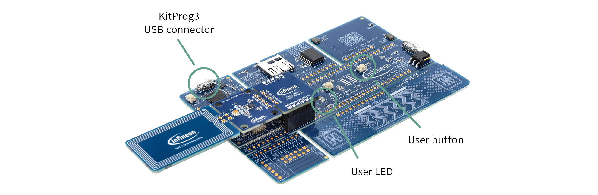

# OPTIGA&trade; Authenticate NBT Host Library for ModusToolbox&trade;

This is the OPTIGA&trade; Authenticate NBT Host Library for ModusToolbox&trade;, which supports the utilization of the OPTIGA&trade; Authenticate NBT in embedded ModusToolbox&trade; applications.

## Overview

The OPTIGA&trade; Authenticate NBT Host Library for ModusToolbox&trade; is an adapted version of the generic [OPTIGA&trade; Authenticate NBT Host Library for C](https://github.com/infineon/optiga-nbt-lib-c) and targets ModusToolbox&trade; applications that interact with the OPTIGA&trade; Authenticate NBT via the I2C interface.
The ModusToolbox&trade; version bundles the [OPTIGA&trade; Authenticate NBT Host Library for C](https://github.com/Infineon/optiga-nbt-lib-c) for embedded devices alongside a platform integration for the [PSOC™ 62S2 Wi-Fi Bluetooth&reg; Prototyping Kit](https://www.infineon.com/CY8CPROTO-062S2-43439) that is part of the [OPTIGA&trade; Authenticate NBT Development Kit](https://www.infineon.com/OPTIGA-Authenticate-NBT-Dev-Kit).
As the integration is relying heavily on the ModusToolbox&trade; HAL layer, it can be easily ported to any other I2C-enabled microcontroller supported by ModusToolbox&trade;.

The availability of the library via ModusToolbox&trade; vastly simplifies the steps to integrate the library into existing, or new ModusToolbox&trade; applications. Further, the library provides an easy-to-use abstraction of the I2C communication to the OPTIGA&trade; Authenticate NBT to speed-up the development of applications with the OPTIGA&trade; Authenticate NBT. The embedded example applications for the OPTIGA&trade; Authenticate NBT are provided in the form of ModusToolbox&trade; applications (see [OPTIGA&trade; Authenticate NBT - GitHub overview](https://github.com/Infineon/optiga-nbt)) that build their application logic on top of this host library. Furthermore, this host library can be easily integrated in any ModusToolbox&trade;-based application which targets to utilize an OPTIGA&trade; Authenticate NBT device.

Refer to the [OPTIGA&trade; Authenticate NBT - GitHub overview](https://github.com/Infineon/optiga-nbt) repository for an overview of the available host software for the OPTIGA&trade; Authenticate NBT. The [OPTIGA&trade; Authenticate NBT - product page](https://www.infineon.com/OPTIGA-Authenticate-NBT) contains a collection of all available documentation and support material for the OPTIGA&trade; Authenticate NBT.

## Features

- NFC-to-I2C bridge commands for device-to-device interactions via the OPTIGA&trade; Authenticate NBT
- C host library (bare-metal and RTOS support)
- Multiple [example applications](#example-applications) showing the usage of this host library in different use cases of the OPTIGA&trade; Authenticate NBT

## Getting Started

This section contains information on how to integrate and utilize the ModusToolbox&trade; C host library in custom ModusToolbox&trade; applications.

### Evaluation and development kits

Infineon offers two reference hardware bundles to simplify the evaluation of the OPTIGA&trade; Authenticate NBT, the [OPTIGA&trade; Authenticate NBT Development Kit](https://www.infineon.com/OPTIGA-Authenticate-NBT-Dev-Kit) and the [OPTIGA&trade; Authenticate NBT Development Shield](https://www.infineon.com/OPTIGA-Authenticate-NBT-Dev-Shield).

**Figure 1. OPTIGA&trade; Authenticate NBT Development Kit**

The [OPTIGA&trade; Authenticate NBT Development Kit](https://www.infineon.com/OPTIGA-Authenticate-NBT-Dev-Kit) is an assembly of hardware components which includes all required hardware components to develop and evaluate applications for the OPTIGA&trade; Authenticate NBT.
The kit includes the OPTIGA&trade; Authenticate NBT Development Shield and, additionally, the [PSOC™ 62S2 Wi-Fi Bluetooth&reg; Prototyping Kit](https://www.infineon.com/CY8CPROTO-062S2-43439) as host microcontroller board.
For more information about the OPTIGA&trade; Authenticate NBT Development Kit refer to the user guide, available on its [product page](https://www.infineon.com/OPTIGA-Authenticate-NBT-Dev-Kit).

**Figure 2. OPTIGA&trade; Authenticate NBT Development Shield (including Arduino-UNO compatible adapter)**

The [OPTIGA&trade; Authenticate NBT Development Shield](https://www.infineon.com/OPTIGA-Authenticate-NBT-Dev-Shield) is an assembly of hardware components which can be used in combination with a host microcontroller board to develop and evaluate applications for the OPTIGA&trade; Authenticate NBT. The shield consists of the OPTIGA&trade; Authenticate NBT device, an NFC antenna, and a pin-header to connect to any custom microcontroller via I2C (for embedded applications).
Per default, the bundle comes with a detachable Arduino-UNO compatible adapter (see figure) to allow *plug-and-play operation* with various host microcontroller boards.
For more information about the OPTIGA&trade; Authenticate NBT Development Shield, refer to the user guide, available on its [product page](https://www.infineon.com/OPTIGA-Authenticate-NBT-Dev-Shield).

### Example applications

Infineon provides multiple example applications for different use cases of the OPTIGA&trade; Authenticate NBT, refer to the [OPTIGA&trade; Authenticate NBT - GitHub overview](https://github.com/Infineon/optiga-nbt) repository for an overview.
The embedded example applications are provided as ModusToolbox&trade; code examples and utilize the OPTIGA&trade; Authenticate NBT Host Library for ModusToolbox&trade;.

| Use case | ModusToolbox&trade; example |
| -------- |---------------------------- |
| Host parameterization via async. data transfer | [*NBT Asynchronous Data Transfer*](https://www.github.com/Infineon/mtb-example-optiga-nbt-adt) embedded application |
| Host parameterization via pass-through         | [*NBT Pass-Through*](https://www.github.com/Infineon/mtb-example-optiga-nbt-pt) embedded application |
| Static connection handover                     | [*NBT Static Connection Handover*](https://www.github.com/Infineon/mtb-example-optiga-nbt-sch) embedded application |

The applications show the usage of the ModusToolbox&trade; C host library in combination with the [OPTIGA&trade; Authenticate NBT Development Kit](https://www.infineon.com/OPTIGA-Authenticate-NBT-Dev-Kit) in simple examples of different use cases.

### Alternative host microcontroller

For the evaluation of the OPTIGA&trade; Authenticate NBT, other host boards than the [OPTIGA&trade; Authenticate NBT Development Kit's](https://www.infineon.com/OPTIGA-Authenticate-NBT-Dev-Kit) default host board [(PSOC™ 62S2 Wi-Fi Bluetooth&reg; Prototyping Kit)](https://www.infineon.com/CY8CPROTO-062S2-43439) may be desired.
The easiest option to evaluate the OPTIGA&trade; Authenticate NBT in an alternative microcontroller setup is by utilizing the [OPTIGA&trade; Authenticate NBT Development Shield](https://www.infineon.com/OPTIGA-Authenticate-NBT-Dev-Shield) and connecting it to the desired host microcontroller (board). See the OPTIGA&trade; Authenticate NBT Development Shield's [product page](https://www.infineon.com/OPTIGA-Authenticate-NBT-Dev-Shield) for more information.

**Table 1. Mapping of the OPTIGA&trade; Authenticate NBT Development Shield's pins to a an alternative microcontroller board**

| OPTIGA&trade; Authenticate NBT Development Shield | Alternative MCU board | Function |
| ------------------------------------------------- | --------------------- | -------- |
| SDA                           | SDA-capable GPIO        | I2C data                   |
| SCL                           | SCL-capable GPIO        | I2C clock                  |
| IRQ                           | IRQ-capable GPIO        | Interrupt                  |
| 3V3                           | 3V3                     | Power and pad supply (3V3) |
| GND                           | GND                     | Common ground reference    |

The host microcontroller's pins to connect to the OPTIGA&trade; Authenticate NBT Development Shield can be freely chosen. But as shown in the table, it has to be made sure that the desired pins of the alternative microcontroller support the required functionality.

#### Supported by ModusToolbox&trade;

If the desired microcontroller board is supported and available in ModusToolbox&trade;, it is recommended to utilize this ecosystem and the included OPTIGA&trade; Authenticate NBT Host Library for ModusToolbox&trade; for the evaluation and development of applications. The host library for ModusToolbox&trade; includes the implementation of a platform-abstraction for the [(PSOC™ 62S2 Wi-Fi Bluetooth&reg; Prototyping Kit)](https://www.infineon.com/CY8CPROTO-062S2-43439), based on the ModusToolbox&trade; HAL layer. This implementation can be utilized to reduce the effort of migrating the OPTIGA&trade; Authenticate NBT library/applications to any platform supported by ModusToolbox&trade;.

The following steps are required after adding this host library to a custom ModusToolbox&trade;, application.
The application needs to configure and initialize its peripherals according to the connection with the OPTIGA&trade; Authenticate NBT. The resulting HAL abstraction objects (for example, I2C and IRQ) can then be passed to the respective initialization functions of the host library. After the initialization, the library implicitly utilizes the platform-specific hardware peripherals to communicate with the OPTIGA&trade; Authenticate NBT. While certain interfaces are implicitly handled within the library's communication stack (for example I2C), others need to be handled by the application itself (for example the IRQ).

Both, the I2C HAL object and the IRQ HAL object need to be defined and initialized in the application.
A HAL I2C object is to be passed to the OPTIGA&trade; Authenticate NBT library during its initialization, since the library implicitly handles the I2C communication.
Since the interrupt functionality is not handled by the library stack, the functionality to recognize an interrupt and react accordingly has to be implemented on application level.

Refer to the [ModusToolbox&trade; example applications](#example-applications), their implementations and project structures for concrete examples of how to initialize the host library for ModusToolbox&trade; and utilize the library's included PAL implementation.
[Usage in custom projects](#usage-in-custom-projects) provides further details about the required configuration to utilize the host library in custom ModusToolbox&trade; applications.

#### Not supported by ModusToolbox&trade;

If the desired microcontroller platform is not supported by ModusToolbox&trade; it is recommended to use the generic [OPTIGA&trade; Authenticate NBT Host Library for C](https://github.com/infineon/optiga-nbt-lib-c). This library provides more flexibility for integrating into custom applications on arbitrary platforms. Since this library is the base of the OPTIGA&trade; Authenticate NBT Host Library for ModusToolbox&trade;, the embedded example applications for ModusToolbox&trade; can also be utilized to support the application development with the generic OPTIGA&trade; Authenticate NBT Host Library for C.

## Usage in custom projects

To use the libraries in your own projects, you can use standard ModusToolbox&trade; functionality with minor configuration on top.

1. Create a ModusToolbox&trade; project with the target board for the application.
2. Add the following dependencies to the project using the ModusToolbox&trade; library manager:
    - [optiga-nbt-lib-c-mtb](https://github.com/Infineon/optiga-nbt-lib-c-mtb) – OPTIGA&trade; Authenticate NBT: ModusToolbox&trade; C Library
    - (OPTIONAL) [retarget-io](https://github.com/Infineon/retarget-io) – Utility library to retarget STDIO messages to a UART port - only required if logging framework is used.
    - (OPTIONAL) [freertos](https://github.com/Infineon/freertos) – FreeRTOS for Infineon MCUs.
      The OPTIGA&trade; Authenticate NBT library will detect if an RTOS is being used and configure itself accordingly.
3. (OPTIONAL) Add the FreeRTOSConfig.h file to your project based on the selected core.
4. Update the Makefile configurations
    - Define the required macro `T1PRIME_INTERFACE_I2C`
      The line should look like this: `DEFINES+=T1PRIME_INTERFACE_I2C`
    - (OPTIONAL) Define the macro `CY_RETARGET_IO_CONVERT_LF_TO_CRLF` if using the logging framework.
    The line should look like this: `DEFINES+=CY_RETARGET_IO_CONVERT_LF_TO_CRLF`
    - (OPTIONAL) Add the component definitions `FREERTOS` and `RTOS_AWARE`. This is obviously only required if targeting FreeRTOS.
        The line should look like this: `COMPONENTS+=FREERTOS RTOS_AWARE`

## Additional information

### Related resources

- [OPTIGA&trade; Authenticate NBT - product page](https://www.infineon.com/OPTIGA-Authenticate-NBT)
- [OPTIGA&trade; Authenticate NBT - GitHub overview](https://github.com/Infineon/optiga-nbt)
- [OPTIGA&trade; Authenticate NBT Development Kit - product page](https://www.infineon.com/OPTIGA-Authenticate-NBT-Dev-Kit)
- [OPTIGA&trade; Authenticate NBT Development Shield - product page](https://www.infineon.com/OPTIGA-Authenticate-NBT-Dev-Shield)
- [ModusToolbox&trade; Software Environment, Quick Start Guide, Documentation, and Videos](https://www.infineon.com/cms/en/design-support/tools/sdk/modustoolbox-software)

### License

This project is licensed under the MIT License - see the [LICENSE](LICENSE) file for details.
